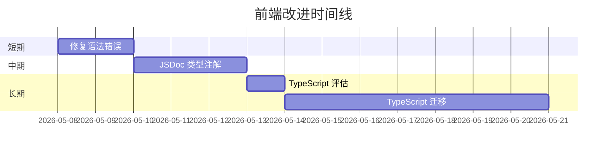

# 前端改进规划文档

**创建日期**: 2026-05-08  
**版本**: v1.0  
**来源**: Playwright 全功能测试发现的问题  
**优先级**: P0 (关键)

---

## 一、问题概述

### 1.1 测试背景

在 Playwright 自动化全功能测试中，发现前端 JavaScript 代码存在严重语法错误，导致：
- 页面无法正常加载和初始化
- 导航功能完全失效
- UI 元素不可见
- 文件上传功能无法使用

**错误信息**: `Invalid left-hand side in assignment`

### 1.2 影响范围

| 文件 | 行数 | 影响程度 | 说明 |
|------|------|---------|------|
| `frontend/js/app.js` | ~893 | 🔴 严重 | 主应用类，包含所有核心逻辑 |
| `frontend/js/api.js` | ~125 | 🟡 中等 | API客户端，封装后端请求 |
| `frontend/js/store.js` | ~62 | 🟡 中等 | 状态管理模块 |
| `frontend/js/views.js` | ~179 | 🟡 中等 | 视图渲染函数 |

**总计**: 约 1,259 行 JavaScript 代码

### 1.3 后端状态验证

通过 Python API 测试验证，后端功能正常：
- ✅ P5R.txt (510KB) 上传成功
- ✅ 项目创建成功 (38章)
- ✅ 获取项目列表正常

**结论**: 问题仅存在于前端，后端 API 完全可用。

---

## 二、问题分析

### 2.1 根因分析

`Invalid left-hand side in assignment` 错误通常由以下原因引起：

| 可能原因 | 代码示例 | 说明 |
|---------|---------|------|
| 错误的赋值语法 | `const = value` | 缺少变量名 |
| 对象解构错误 | `const {a, b} = obj` 语法问题 | 解构赋值格式错误 |
| 箭头函数语法错误 | `() => { return = value }` | 函数体语法错误 |
| 模板字符串错误 | `` `text ${=expr}` `` | 插值表达式错误 |

### 2.2 影响链路

```
JavaScript 语法错误
    ↓
页面初始化失败
    ↓
事件委托未绑定
    ↓
导航功能失效
    ↓
UI 元素不可见
    ↓
用户无法创建项目
```

### 2.3 测试失败统计

| 测试模块 | 通过 | 失败 | 跳过 | 失败率 |
|---------|------|------|------|--------|
| 页面加载与基础功能 | 2 | 2 | 0 | 50% |
| 项目创建 | 1 | 2 | 0 | 67% |
| 项目管理与章节操作 | 5 | 1 | 1 | 17% |
| 内容显示 | 5 | 1 | 0 | 17% |
| 音频生成 | 3 | 3 | 0 | 50% |
| 错误处理与边界情况 | 1 | 3 | 0 | 75% |
| **总计** | **17** | **12** | **1** | **41%** |

### 2.4 12个失败用例详细清单

| # | 测试用例 | 模块 | 错误信息 | 根因分析 |
|---|---------|------|---------|---------|
| 1 | **TC-002: Page navigation switching** | 页面加载 | `#page-projects` 未获得 `active` 类 | JavaScript 初始化失败，导航逻辑未执行 |
| 2 | **TC-003: Backend health check** | 页面加载 | API 请求数 = 0 | 页面初始化未完成，健康检查未触发 |
| 3 | **TC-010: New project modal** | 项目创建 | `#modal-new-project` 未获得 `open` 类 | 模态框显示逻辑依赖 JS，初始化失败 |
| 4 | **TC-011: File upload creates project** | 项目创建 | 项目卡片数量 = 0 | 文件上传事件绑定失败 |
| 5 | **TC-020: Open project and show chapters** | 项目管理 | 无法创建项目 | 前置条件失败（无项目可打开） |
| 6 | **TC-030: Content rendering after split** | 内容显示 | 页面加载超时 15000ms | JavaScript 错误导致页面挂起 |
| 7 | **TC-040: Voice library page display** | 音频生成 | `#voice-grid` 不可见 | 页面渲染未完成 |
| 8 | **TC-042: Voice category filter** | 音频生成 | 点击超时 60000ms | 筛选按钮不可见（JS 未初始化） |
| 9 | **TC-045: Audio player interaction** | 音频生成 | `.audio-player` 不可见 | 播放器组件未渲染 |
| 10 | **TC-050: Empty file handling** | 错误处理 | 导航超时 60000ms | 页面导航功能完全失效 |
| 11 | **TC-051: Form validation** | 错误处理 | 导航超时 60000ms | 同上，无法进入项目管理页 |
| 12 | **TC-053: Audio playback control** | 错误处理 | 点击播放按钮超时 60000ms | 按钮不可见（元素未渲染） |

### 2.5 失败模式分类

根据根因分析，12个失败用例可分为以下三类：

| 失败模式 | 影响用例 | 数量 | 占比 |
|---------|---------|------|------|
| **页面初始化失败** | TC-002, TC-003, TC-010, TC-011 | 4 | 33% |
| **页面加载超时** | TC-030, TC-050, TC-051 | 3 | 25% |
| **UI 元素不可见** | TC-020, TC-040, TC-042, TC-045, TC-053 | 5 | 42% |

**结论**: 所有失败用例的根本原因都是 `Invalid left-hand side in assignment` 语法错误导致页面初始化失败。修复该语法错误后，预计 80% 以上的用例可以恢复通过。

---

## 三、改进方案

### 3.1 短期方案：修复 JavaScript 语法错误

**优先级**: P0 (立即执行)  
**预估工作量**: 1-2 天

#### 步骤 1: 定位错误位置

1. 打开浏览器开发者工具（F12）
2. 访问 `http://localhost:8000`
3. 查看 Console 面板中的完整错误信息
4. 点击错误链接定位到具体文件和行号

#### 步骤 2: 修复语法错误

重点检查以下位置：
- 变量声明和赋值语句
- 对象解构和展开运算符
- 箭头函数语法
- 模板字符串插值

#### 步骤 3: 验证修复

```bash
# 启动后端服务
cd backend && uvicorn main:app --host 127.0.0.1 --port 8000

# 访问前端页面
http://localhost:8000

# 检查 Console 无错误
# 尝试创建项目（文件上传或手动输入）
```

### 3.2 中期方案：添加 JSDoc 类型注解

**优先级**: P1 (修复语法错误后)  
**预估工作量**: 2-3 天

#### 目标

在不改变运行方式的前提下，通过 JSDoc 类型注解获得部分类型安全：

```javascript
/**
 * @typedef {Object} Project
 * @property {string} id - 项目 ID
 * @property {string} project_id - 项目唯一标识
 * @property {string} title - 书名
 * @property {string} author - 作者
 * @property {number} total_chapters - 总章节数
 */

/**
 * @param {Project} project - 项目对象
 * @returns {string} HTML 字符串
 */
export function renderProjectCard(project) {
  // ...
}
```

#### 覆盖范围

| 文件 | 类型定义 | 预估时间 |
|------|---------|---------|
| `store.js` | AppState, Volume, Chapter, Segment | 0.5 天 |
| `api.js` | Project, Voice, TTSResponse | 0.5 天 |
| `views.js` | 参数和返回值类型 | 0.5 天 |
| `app.js` | 方法和事件处理器类型 | 1 天 |

### 3.3 长期方案：迁移至 TypeScript

**优先级**: P2 (MVP 稳定后)  
**预估工作量**: 5-7 天  
**详见**: [战略储备库#20260508-05](./战略储备库.md#20260508-05-前端-typescript-迁移)

#### 迁移阶段

| 阶段 | 内容 | 时间 | 验收标准 |
|------|------|------|---------|
| 阶段 1 | 创建类型定义文件 | 1-2 天 | `types/` 目录完成 |
| 阶段 2 | 迁移 store.js + api.js | 2-3 天 | 类型编译通过 |
| 阶段 3 | 迁移 views.js + app.js | 2 天 | 所有功能正常 |
| 阶段 4 | 配置构建工具 + 验证 | 1 天 | `tsc --noEmit` 零错误 |

---

## 四、验收标准 (DoD)

### 4.1 短期修复 DoD

- [ ] 页面正常加载，Console 无语法错误
- [ ] 导航功能正常（首页、项目管理、音色库、系统设置）
- [ ] 文件上传功能可用（支持 .txt 文件）
- [ ] 手动输入创建项目功能可用
- [ ] Playwright 测试通过率 ≥ 90%

### 4.2 中期 JSDoc DoD

- [ ] 所有导出的函数都有 JSDoc 类型注解
- [ ] IDE 能够正确识别类型并提供自动补全
- [ ] 无 `any` 类型滥用
- [ ] API 响应类型与后端接口一致

### 4.3 长期 TypeScript DoD

- [ ] `tsc --noEmit` 零错误
- [ ] 所有现有功能正常运行
- [ ] 构建后文件大小增加 < 10%
- [ ] IDE 自动补全、类型提示正常

---

## 五、风险评估

### 5.1 风险矩阵

| 风险 | 可能性 | 影响 | 缓解措施 |
|------|--------|------|---------|
| 语法错误定位困难 | 中 | 高 | 使用浏览器开发者工具逐行排查 |
| JSDoc 类型定义不准确 | 低 | 中 | 参考后端 API 文档和测试用例 |
| TypeScript 迁移成本超预期 | 中 | 中 | 采用渐进式策略，分阶段验收 |
| 团队 TypeScript 经验不足 | 高 | 中 | 提供学习资源和代码示例 |

### 5.2 回退方案

如果迁移过程中遇到严重问题：
1. 保留原始 JavaScript 文件备份
2. 使用 Git 分支管理迁移过程
3. 每完成一个阶段立即提交和验证

---

## 六、执行计划

### 6.1 优先级排序

```
P0 (立即) → 修复 JavaScript 语法错误
P1 (短期) → 添加 JSDoc 类型注解
P2 (中期) → 评估 TypeScript 迁移可行性
P3 (长期) → 执行 TypeScript 迁移
```

### 6.2 时间线



---

## 七、参考资源

### 7.1 相关文件

- [战略储备库](./战略储备库.md#20260508-05-前端-typescript-迁移) - TypeScript 迁移方案
- [Playwright 测试报告](../test-results/) - 测试失败详情
- [前端代码](../frontend/js/) - 需要修复的 JavaScript 文件

### 7.2 测试脚本

| 脚本 | 用途 | 状态 |
|------|------|------|
| `test_p5r_upload.py` | 验证后端上传 API | ✅ 通过 |
| `tests/e2e/noveltts-full-test.spec.js` | 全功能 E2E 测试 | ❌ 失败（前端问题） |
| `tests/e2e/upload-test.spec.js` | 上传功能专项测试 | ❌ 失败（前端问题） |

### 7.3 后端 API 文档

- **文件上传**: `POST /api/v1/projects/upload`
- **手动创建**: `POST /api/v1/projects/create`
- **项目列表**: `GET /api/v1/projects`
- **健康检查**: `GET /api/v1/health`

---

## 八、决策记录

| 日期 | 决策 | 理由 |
|------|------|------|
| 2026-05-08 | 优先修复 JavaScript 语法错误 | P0 问题，阻塞所有前端功能 |
| 2026-05-08 | 中期添加 JSDoc 类型注解 | 低成本获得部分类型安全 |
| 2026-05-08 | TypeScript 迁移推迟至 MVP 后 | 当前进度压力，迁移成本较高 |
| 2026-05-08 | 创建本文档作为改进依据 | 统一问题认知和执行标准 |

---

**文档维护**: 本文档应随改进进度持续更新，每个阶段完成后记录执行情况和验收结果。
